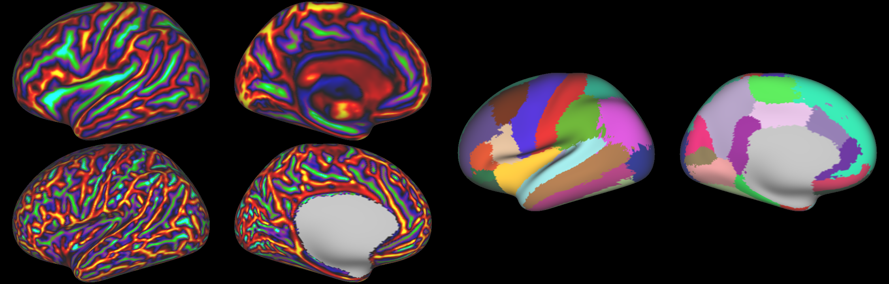

# The Surface Vision Transformer family

This repository contains codebase to use surface vision transformers models on surface data (e.g cortical data). This repository contains the **official** PyTorch implementation of:

- SiT -  [*The Surface Vision Transformers: Attention-Based Modelling applied to Cortical Analysis*](https://arxiv.org/abs/2203.16414) [MIDL2022]

- MS-SiT - [*The Multiscale Surface Vision Transformer*](https://arxiv.org/abs/2303.11909) [MIDL2024]


# Outline

This repository list the instructions to access preprocessed cortical data for regression, classification and segmentation tasks; and to train *SiT* and *MS-SiT* models.

<p><a href="#updates">1. Updates</a></p>
<p><a href="#install">2. Installation & Set-up</a></p>
<p><a href="#data">3. Accessing data</a></p>
<p><a href="#training">4. Training & Inference</a></p>

Here, Surface Vision Transformer (**SiT**) is applied on cortical data for phenotype predictions.


# 1. Updates 
<a id="updates"></a>

<details>
    <summary><b> 🔥 V.3.0 - 19.09.24</b></summary>
    Major codebase update - 18.09.24
    <ul type="circle">
        <li> Adding MS-SiT segmentation codebase</li>
        <li> Adding metrics files dataloader for SiT and MS-SiT models (numpy loader stil available)</li>
        <li> Update GIN repository for dHCP access </li>
        <li> Adding new GIN repository with MindBoggle dataset</li>
    </ul>
</details>

<details>
    <summary><b> V.2.0 - 22.07.24</b></summary>
    Major codebase update - 22.07.24
    <ul type="circle">
        <li> Adding MS-SiT model into the codebase</li>
    </ul>
</details>

<details>
    <summary><b> V.1.1 - 12.02.24</b></summary>
    Major codebase update - 12.02.24
    <ul type="circle">
        <li> Adding masked patch pretraining code to codebase</li>
        <li> can be run as simply as with: python pretrain.py ../config/SiT/pretraining/mpp.yml </li>
    </ul>
</details>


<details>
    <summary><b> V.1.0 - 18.07.22</b></summary>
    Major codebase update - 18.07.22
    <ul type="circle">
        <li> birth age and scan age prediction tasks</li>
        <li> simplifying training script </li>
        <li> adding birth age prediction script </li>
        <li> simplifying preprocessing script </li>
        <li> ingle config file tasks (scan age / birth age) and data configurations (template / native)</li>
        <li> adding mesh indices to extract non-overlapping triangular patches from a cortical mesh ico 6 sphere representation</li>
    </ul>
</details>

<details>
    <summary><b> V.0.2</b></summary>
    Update - 25.05.22
    <ul type="circle">
        <li> testing file and config </li>
        <li> installation guidelines </li>
        <li> data access </li>
    </ul>
</details>

<details>
    <summary><b> V.0.1</b></summary>
    Initial commits - 12.10.21
    <ul type="circle">
        <li> training script </li>
        <li> README </li>
        <li> config file for training </li>
    </ul>
</details>

# 2. Installation & Set-up 
<a id="install"></a>

## a. Connectome Workbench

Connectome Workbench is a free software for visualising neuroimaging data and can be used for visualising cortical metrics on surfaces. Downloads and instructions [here](https://www.humanconnectome.org/software/connectome-workbench). 

## b. Conda usage

For PyTorch and dependencies installation with conda, please follow instructions in [install.md](docs/install.md).

## c. Docker usage

**Coming soon**

For docker support, please follow instructions in [docker.md](docs/docker.md)


# 3. Accessing data
<a id="data"></a>

## a. dHCP pre-processed dataset - regression


The data used in these projects for regression tasks are cortical metrics (cortical thickness, curvature, myelin maps and sulcal depth maps) from the [dHCP dataset](http://www.developingconnectome.org/). Instructions for processing MRI scans and extract cortical metrics can be found in [S. Dahan et al 2021](https://arxiv.org/abs/2203.16414) and references cited in.

To simplify reproducibility of the work, data has been already pre-processed (compiled into **numpy array** or into raw **gifti** files) and is made available following the next guidelines. 

### Accessing pre-processed data

Cortical surface metrics (cortical thickness, curvature, myelin maps and sulcal depth maps) already processed as in [S. Dahan et al 2021](https://arxiv.org/abs/2203.16414) and [A. Fawaz et al 2021](https://www.biorxiv.org/content/10.1101/2021.12.01.470730v1) are available upon request. 

<details>
    <summary><b> Sign dHCP access agreement</b></summary>
    <p>
    To access the data please:
    <br>
        <ul type="circle">
            <li>Sign in <a href="https://data.developingconnectome.org/app/template/Login.vm">here</a> </li>
            <li>Sign the dHCP open access agreement </li>
            <li> Forward the confirmation email to <b> simon.dahan@kcl.ac.uk</b>  </li>
        </ul>
    </p>
</details>

<details>
    <summary><b> Create a G-Node GIN account</b></summary>
    <p>
    Please create an account on the GIN plateform <a href="https://gin.g-node.org/">here</a> 
    </p>
</details>
<details>
  <summary><b> Get access to the G-Node GIN repository</b></summary>
      <p>
      <ul type="circle">
            <li>Please also share your G-Node username to <b> simon.dahan@kcl.ac.uk</b> </li>
            <li> Then, you will to be added to this repository <a href="https://gin.g-node.org/Sdahan30/slcn_2023">SLCN 2023</a></li>
        </ul>
      </p>
</details>

<br></br>

**Training**, **validation** and **testing** sets are available, as used in as in [S. Dahan et al 2021](https://arxiv.org/abs/2203.16414) and [A. Fawaz et al 2021](https://www.biorxiv.org/content/10.1101/2021.12.01.470730v1), for the task of **birth-age** (gestational age -  GA) and **scan-age** (postmenstrual age at scan - PMA) prediction, in **template** and **native** configurations.

dHCP data has been resampled to ico6 (40k vertices) resolution. Left and right hemispheres are symmetrised, see image below. 


Important, the dHCP data is accessible in two format: numpy and gifti format. 

### Numpy format

In numpy format, the surface data is already patched (as explained in [S. Dahan et al 2021](https://arxiv.org/abs/2203.16414)) with ico2 grid, and compiled into train, validation and test arrays. Each array has a shape of: `(B,N,C,V)`with B the number of subjects, N the number of patches (320), C the number of input channels (4) and V the number of verticse per patch (153).

### Gifti format

We also make available gifti files with the different cortical metrics merged per subject and per hemisphere. For instance, `sub-CC00051XX02_ses-7702_L.shape.gii` contains the 4 cortical metrics merged into a single file at the ico6 (40k vertices) resolution. 

This data format is more flexible for futher post-processing (if needed) but also to build more complex dataloading strategies (with data augmentations for instance, see below xx). 

 
## b. MindBoggle dataset - segmentation 

The MindBoggle dataset with cortical metrics (sulcal depth and curvature) has been further pre-processed with MSMSulc alignement and resampling to ico6 resolution (40k vertices). 

### Accessing pre-processed data

Pre-processed MindBoggle data is available in the following G-Node GIN repository: <a href="https://gin.g-node.org/Sdahan30/MindBoggle-preprocessed">MindBoggle processed dataset</a>.


 Please create an account and forward your username at **simon.dahan@kcl.ac.uk** to be added to the repository and access the data. 



<br></br>

# 4. Training & Inference
<a id="training"></a>

This repository is thought as a modular framework. Most of the models and training hyperparameters can be set within config files, used as input to the training scripts. Training scripts are located within the `tools/` folder.

## Training SiT/MS-SiT for regression tasks

Once in the `tools` folder, one can start training an SiT or MS-SiT model with the following command:
```
python train.py ../config/SiT/training/hparams.yml
```

or 

```
python train.py ../config/MS-SiT/training/hparams.yml
```

Where all hyperparameters for training and model design models are to be set in the yaml file `config/SiT/training/hparams.yml` and `config/MS-SiT/training/hparams.yml`, such as: 

- Transformer architecture
- Training strategy: from scratch, ImageNet or SSL weights
- Optimisation strategy
- Patching configuration
- Logging

One important point, as explained previously in the dHCP section, data is available either in *numpy* or *gifti*  format. The parameter `data/loader` in the config files should be set accordingly. 

## Training MS-SiT for segmentation tasks

The MS-SiT model can be used to train segmentation model as follows:

```
python train_segmentation.py ../config/MS-SiT/segmentation/hparams.yml
```
Here, only the `metrics` dataloader is available.

# Tensorboard support

**Coming soon**

# References 

This codebase uses the vision transformer implementation from  
[lucidrains/vit-pytorch](https://github.com/lucidrains/vit-pytorch) and the pre-trained ViT models from the [*timm*](https://github.com/rwightman/pytorch-image-models) librairy. 

# Citation

Please cite these works if you found it useful:

[Surface Vision Transformers: Attention-Based Modelling applied to Cortical Analysis](https://arxiv.org/abs/2203.16414)

```
@InProceedings{pmlr-v172-dahan22a,
  title = 	 {Surface Vision Transformers: Attention-Based Modelling applied to Cortical Analysis},
  author =       {Dahan, Simon and Fawaz, Abdulah and Williams, Logan Z. J. and Yang, Chunhui and Coalson, Timothy S. and Glasser, Matthew F. and Edwards, A. David and Rueckert, Daniel and Robinson, Emma C.},
  booktitle = 	 {Proceedings of The 5th International Conference on Medical Imaging with Deep Learning},
  pages = 	 {282--303},
  year = 	 {2022},
  editor = 	 {Konukoglu, Ender and Menze, Bjoern and Venkataraman, Archana and Baumgartner, Christian and Dou, Qi and Albarqouni, Shadi},
  volume = 	 {172},
  series = 	 {Proceedings of Machine Learning Research},
  month = 	 {06--08 Jul},
  publisher =    {PMLR},
  pdf = 	 {https://proceedings.mlr.press/v172/dahan22a/dahan22a.pdf},
  url = 	 {https://proceedings.mlr.press/v172/dahan22a.html},
}

```

[The Multiscale Surface Vision Transformers](https://arxiv.org/abs/2303.11909)

```
@misc{dahan2024multiscalesurfacevisiontransformer,
      title={The Multiscale Surface Vision Transformer}, 
      author={Simon Dahan and Logan Z. J. Williams and Daniel Rueckert and Emma C. Robinson},
      year={2024},
      eprint={2303.11909},
      archivePrefix={arXiv},
      primaryClass={eess.IV},
      url={https://arxiv.org/abs/2303.11909}, 
}
```
